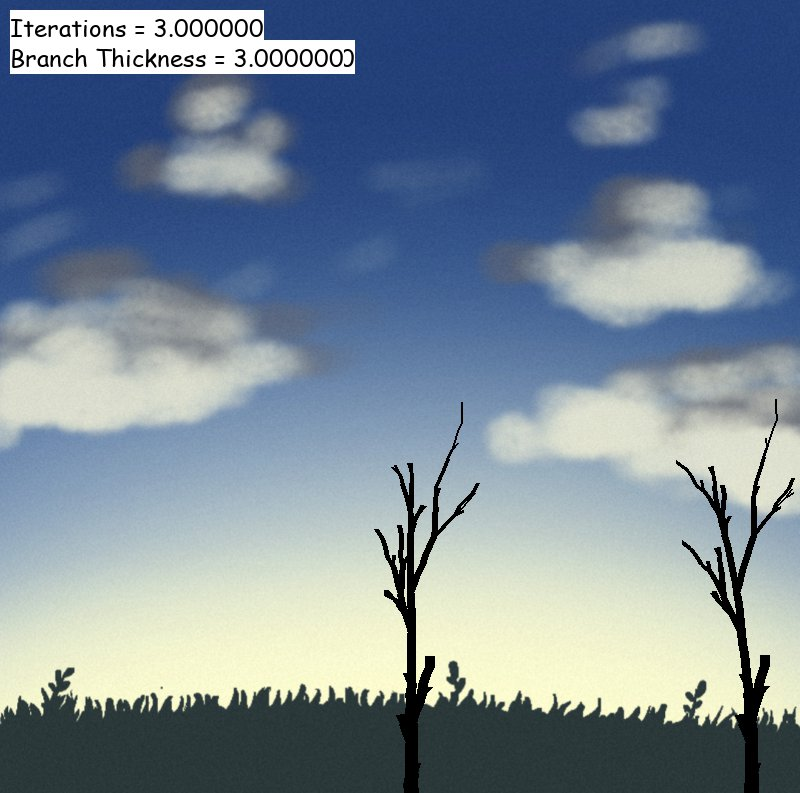

# Welcome to the L-System: Irregular Tree Growth Simulation!
##### This is an implementation of L-Systems developed by Amanda Showler and Joshua Trower
<p align="center">
  
</p>
### Paper:
- See the 'CSCI 301 Course Project.pdf' file

---

### Explanation Video:
- We recorded a quick walkthrough to show the simulation. The link to view is: https://youtu.be/kR5OMTsSg74

---
### Setup:
To run this simulation project:

```
$ python3 -m pip install -U pygame --user
$ python3 l_systems_sim.py {iterations} {number of trees} {background included}
```

Command-line arguments explained:
* {iterations} - The of iterations of L-systems applied to the tree (ex. 10)
* {number of trees} - The number of trees to draw (ex. 3)
* {background included - 0 for no background or 1 for background

